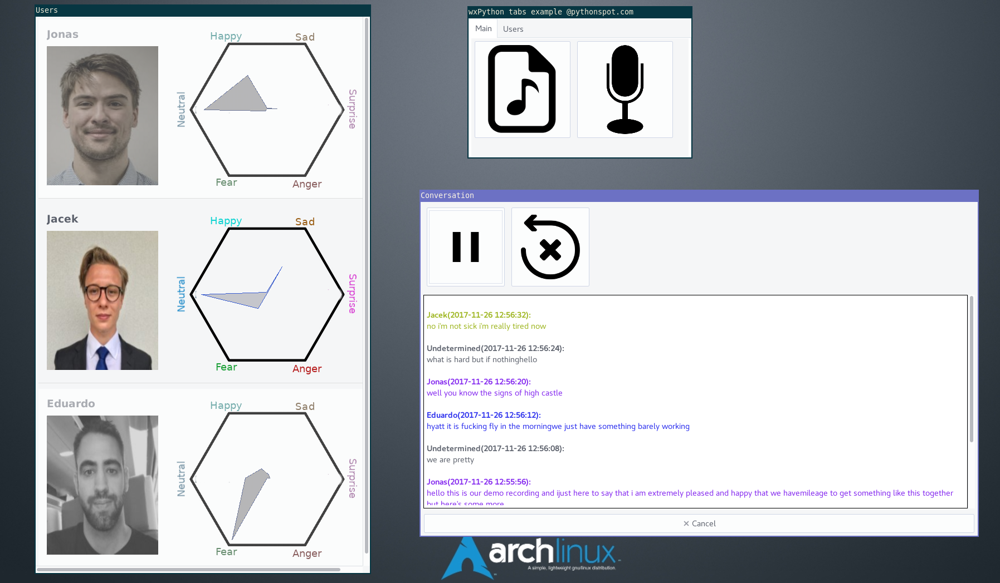

# Speemo
A software for speech analysis using machine learning and signal processing.

## Sentiment analysis of text

The model is composed of a Recurrent NN with 512 LSTM hidden units connected to 6 output units by a Linear Layer. Throughput the training, dropout ration of 0.5 was used on the LSTM units and Linear Layer. See [twitter-sentiment-analysis] for more details.

### Dataset

In a variation on the popular task of sentiment analysis, this dataset contains labels for the emotional content (such as happiness, sadness, and anger) of texts. 40 thousands of examples across 13 labels can be found [here]. The labels have been concentrated to 6 basic Ekman's emotions.

### Pre-processing

Individual words were extracted from tweets using the Twitter Tokenizer from [NLTK] and later converted to vectors using the [GloVe] embedding scheme.

### Training

Training was performed using an Adam SGD algorithm with early stopping. Best results achieved after 10 epochs.

### Dependencies
* [Python] - 3.5 or above
* [pyTorch] - Machine Learning Toolkit
* [torchtext] - Data loaders and abstractions for text and NLP
* [NLTK] - The Natural Language Toolkit

[//]: # (These are reference links used in the body of this note and get stripped out when the markdown processor does its job. There is no need to format nicely because it shouldn't be seen. Thanks SO - http://stackoverflow.com/questions/4823468/store-comments-in-markdown-syntax)

   [Python]: <https://www.python.org/>
   [here]: <https://data.world/crowdflower/sentiment-analysis-in-text>
   [twitter-sentiment-analysis]: <https://github.com/jgolebiowski/twitter-sentiment-analysis>
   [NLTK]: <http://www.nltk.org/>
   [GloVe]: <https://nlp.stanford.edu/projects/glove/>
   [pyTorch]: <http://pytorch.org/>
   [torchtext]: <https://github.com/pytorch/text>
